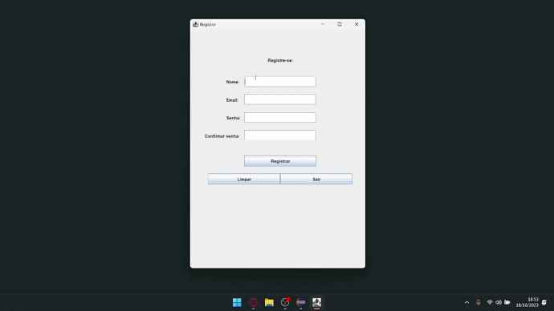
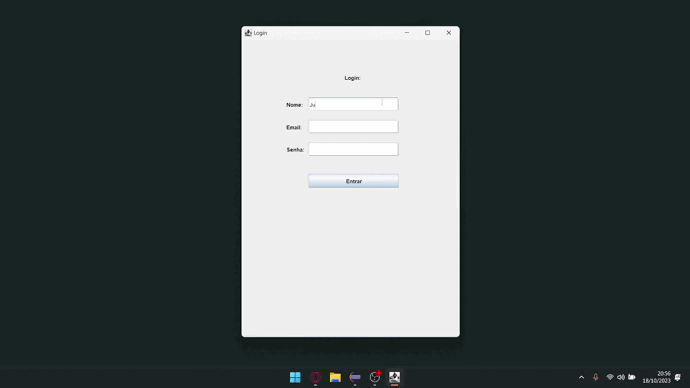
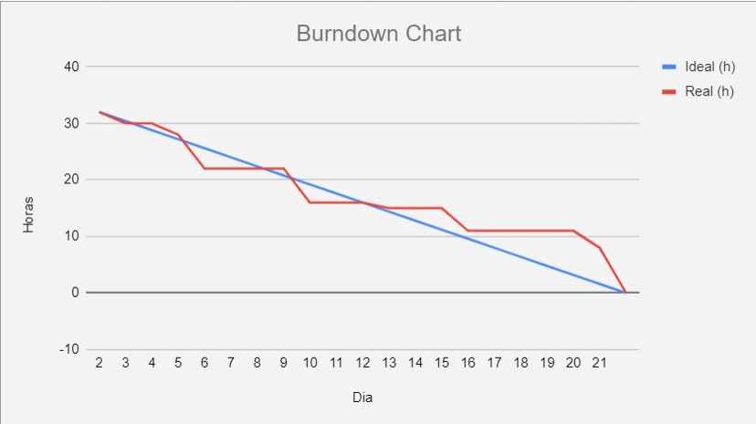
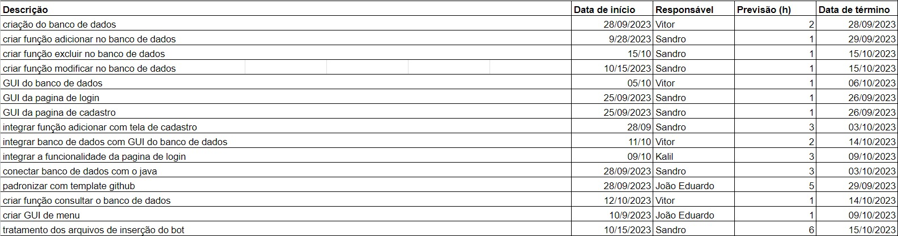

<h1 align="center">Sprint 2: 25/09/2023 a 16/10/2023</h1>

    <a href="#objetivos">Objetivos da sprint</a> &nbsp |&nbsp &nbsp
    <a href="#entregas">Entregas</a> &nbsp |&nbsp &nbsp
    <a href="#metricas">Métricas do time</a>

Nesta segunda sprint, a equipe de voltou a produção com o banco de dados utilizando MySQL, produzindo a parte de registro, login e o menu, podendo escolher entre perguntas e respostas, , além de uma interface para as três. Foi realizada também o CRUD do banco de dados, sendo eles: Create (criar), Read (ler), Update (atualizar) e Delete (apagar). A equipe também teve a tarefa de tratar os dados, fazendo assim o programa diminuir o tamanho do arquivo, excluindo linhas indesejadas ou inúteis para a leitura do Bot.

## 🎯 Objetivos da Sprint

Os objetivos da sprint foram:
- **Funcionalidade Registro:** Permite o usuário registrar sua conta no programa
- **Funcionalidade Login:** Permite o usuário logar a sua conta já existente no programa
- **CRUD do banco de dados:** Permite o usuário a funciona
- **Interface Registro:** Interface para registro de usuário
- **Interface Login:** Interface para login de usuário
- **Interface Menu**: Interface para escolha de telas
- **Tratamento de dados:** Diminuir o tamanho do arquivo, excluindo linhas indesejadas ou inúteis para a leitura do Bot

## ✔️ Entregas

Para esta entrega, foi utilizado os mesmos métodos da entrega anterior

### Funcionalidade Registro

    
Clique aqui para ver detalhes sobre o desenvolvimento desta funcionalidade

     
    Essa funcionalidade foi iniciada e finalizada nesta Sprint. Ela visa registrar os usuários no banco de dados para os mesmos entarem no programa com o login no próximo uso. Ela pede o Nome, Email, Senha e a Confirmação da Senha.
    
    

---

### Funcionalidade Login

    
Clique aqui para ver detalhes sobre o desenvolvimento desta funcionalidade

     
    Essa funcionalidade foi iniciada e finalizada nesta Sprint. Ela visa logar um usuário que já estava registrado no banco de dados, sendo um modo de agilizar a entrada no programa. Ela pede o Nome, Email e a Senha e atualmente precisa dos três para efetuar o login.
    
    

---

### Funcionalidade Menu

    
Clique aqui para ver detalhes sobre o desenvolvimento desta funcionalidade

     
    Essa funcionalidade foi iniciada e finalizada nesta Sprint. Ela visa fazer o usuário escolher para uma das três escolhas: Inserção de arquivos, Perguntar ao assistente e visualizar o banco de dados.

→ [Voltar ao topo](#topo)

## 📈 Métricas da equipe
As tarefas da equipe foram divididas em Backend, Frontend e Database entre os integrantes. Os que possuiam as tarefas de Backend ficaram responsáveis em fazer as funcionalidades da tela de login, tela de registro, tela do banco de dados e do tratamento de dados. Os responsáveis pelas tarefas de Frontend estavam designados a produzir as telas de login, registro, menu e banco de dados. Já os que tinham tarefas de banco de dados estavam responsáveis pela criação do banco e pela conexão da mesma entre as telas de login, registro e banco de dados.
- O acompanhamento de atividades, de responsabilidade do Scrum Master, se encontra na imagem adiante, que contém o gráfico Burndown gerado pela equipe, incluindo as atividades desenvolvidas e seus responsáveis.

    

   
Clique aqui para ver as tarefas realizadas na sprint

   

→ [Voltar ao topo](#topo)
