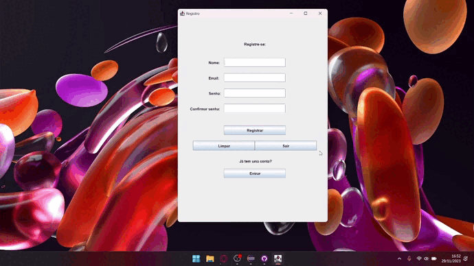
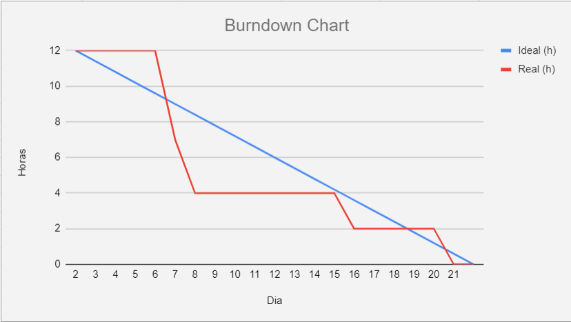

<h1 align="center">Sprint 4: 06/11/2023 a 26/11/2023</h1>

    <a href="#objetivos">Objetivos da sprint</a> &nbsp |&nbsp &nbsp
    <a href="#entregas">Entregas</a> &nbsp |&nbsp &nbsp
    <a href="#metricas">Métricas do time</a>

Nesta quarta e última sprint, a equipe voltou sua produção final para a manutenção final do ChatBot e a funcionalidade de se logar apenas com seu E-mail ou seu nome cadastrado, além de definir o tema como Paleontologia e uma revisão geral do produto final.

## 🎯 Objetivos da Sprint

Os objetivos da sprint foram:
- **Manutenção das telas e do ChatBot:** Uma pequena mudança nas telas e funcionalidades.
- **Logar com E-mail ou nome apenas:** A possibilidade se logar apenas com o E-mail ou senha cadastrados.

## ✔️ Entregas

Para esta entrega, foram utilizados os mesmos métodos das entregas anteriores.

### Login com apenas nome ou E-mail

    
Clique aqui para ver detalhes sobre o desenvolvimento desta funcionalidade

     
    Essa funcionalidade foi iniciada e finalizada nesta sprint. Ela visa a possibilidade se logar apenas com o E-mail ou senha cadastrados anteriormente.
    

→ [Voltar ao topo](#topo)

## 📈 Métricas da equipe
As tarefas foram distribuídas entre alguns membros, sendo poucas tarefas por ser a última sprint.
- O acompanhamento de atividades, de responsabilidade do Scrum Master, se encontra na imagem adiante, que contém o gráfico Burndown gerado pela equipe, incluindo as atividades desenvolvidas e seus responsáveis.

    

→ [Voltar ao topo](#topo)
