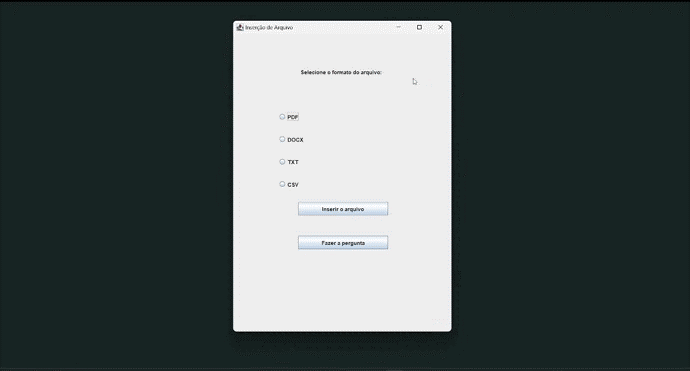
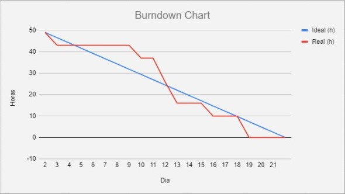

<h1 align="center">Sprint 1: 04/09/2023 a 24/09/2023</h1>

    <a href="#objetivos">Objetivos da sprint</a> &nbsp |&nbsp &nbsp
    <a href="#entregas">Entregas</a> &nbsp |&nbsp &nbsp
    <a href="#metricas">Métricas do time</a>

O projeto é uma produção de assistente virtual e ChatBot para Java Desktop que seja capaz de sanar dúvidas, de qualquer área com a inserção de documentos, agilizando a busca de informações em documentos extensos e auxiliando nas atividades de uma empresa. Tendo em mente o MVP, a 1º Sprint deu início com a produção da interface gráfica da tela de perguntas e respostas e da interface gráfica da tela de inserção de documentos, além da funcionalidade de ambos, sendo elas a inserção de documentos no programa e a leitura do mesmo e a funcionalidade de perguntas e respostas, onde o assistente responde as perguntas feitas pelo usuário em relação ao arquivo.

## 🎯 Objetivos da Sprint

Os objetivos da sprint foram:
- **Importar arquivos:** Importar arquivos do computador para a pasta selecionada
- **Perguntas e respostas:** Responder as perguntas feitas pelo usuário
- **Interface para importação de arquivos:** Interface para importação de arquivos
- **Interface para perguntas e respostas:** Interface para perguntas e respostas

## ✔️ Entregas

Para esta entrega, utilizamos a metodologia Scrum, sendo alguns artefatos o Product Backlog contendo as User Stories, o Burndown Chart e as divisões da equipe, como o PO, o Scrum Master e o Dev Team.
Para entender melhor sobre o produto que o cliente desejava, houve uma aula explicativa sobre os requisitos do projeto

    

→ [Voltar ao topo](#topo)

## 📈 Métricas da equipe
As tarefas da equipe foram divididas com os 6 integrantes, sendo elas a parte Backend e Frontend, onde os integrantes com as tarefas de Backend ficavam responsáveis por inserirem as funcionalidades nas interfaces gráficas criadas pelos integrantes que estavam responsáveis por criar as GUIs das páginas por meio de código.
- O acompanhamento de atividades, de responsabilidade do Scrum Master, se encontra na imagem adiante, que contém o gráfico Burndown gerado pela equipe (onde o eixo X são os dias trabalhados na sprint e os valores do eixo Y representam as horas estimadas de esforço somadas), incluindo as atividades desenvolvidas e seus responsáveis.

  
→ [Voltar ao topo](#topo)
